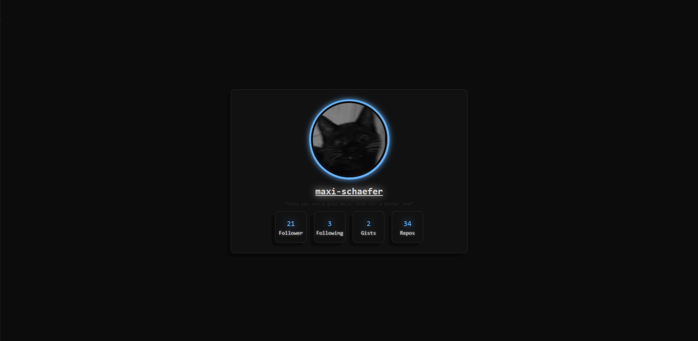

# GithubOverview
Create your own Github Overview website, where you can customize everything

## Preview


## How to Customize
You can find your own Profile Overview under: <a>https://githuboverview.netlify.app?username=yourname</a>

### How to change anything
Go to your Github repositories and under your repository with your name where you can also find your Readme.MD start to create a new file called profile.css.
Then copy following text into it:
```css
:root {
  // Colors
  --main-color: #63b0f7;
  --bg: #0c0c0c;
  --elements: #111111;
  --font: #d4d4d4;
  --font-darker: #292929;

  // Shadow
  --shadow: -10px 10px 0px #00000059;
  
  // Common Border
  --border-radius: 12px;
  --border: 1px solid var(--font-darker);

  // Profile Picture
  --profileBorder: 6px solid var(--main-color);

  .value {
    text-shadow: 0px 0px 20px var(--main-color);
  }
  .type {
    text-shadow: 0px 0px 5px var(--font);
  }
  h1 {
    text-shadow: 0px 0px 20px var(--font);
  }
  .profilePictureWrapper {
    box-shadow: 0px 0px 15px var(--main-color);
  }
}
```

And start changing things like you want!

